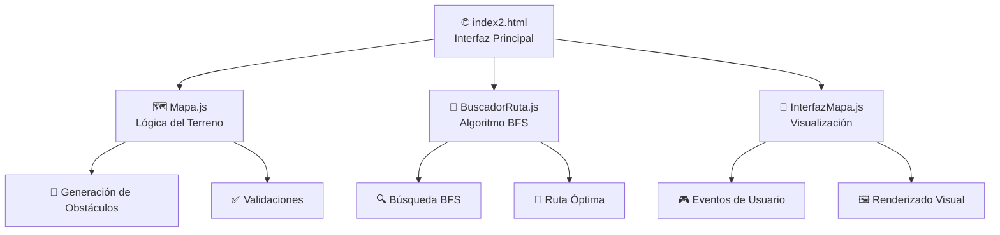

# 🧭 Calculadora de Rutas

<div align="center">


Una aplicación web interactiva para calcular rutas óptimas en mapas personalizables utilizando el algoritmo BFS (Breadth-First Search).

</div>

---

## ✨ Características

<table>
<tr>
<td width="50%">

### 🎮 **Interactividad**
- 🗺️ **Mapas personalizables** con diferentes tamaños (10x10, 15x15, 20x20)
- 🎯 **Configuración de puntos** de inicio y destino
- ⚡ **Interacción en tiempo real** con clic en las celdas

</td>
<td width="50%">

### 🚧 **Obstáculos & Algoritmo**
- 🏢 **Obstáculos diversos**: edificios, agua y zonas bloqueadas  
- 🚀 **Algoritmo BFS** para encontrar la ruta más corta
- 🎨 **Interfaz moderna** con efectos visuales y animaciones

</td>
</tr>
</table>

---

## 🚀 **Instalación**

```bash
# Clonar el repositorio
git clone https://github.com/tu-usuario/calculadora-rutas.git
cd calculadora-rutas

# Ejecutar la aplicación
# Abre index2.html en tu navegador
```

<div align="center">

### 🌐 **¡Solo abre el archivo HTML y comienza a explorar!**

</div>

---

## 🏗️ **Arquitectura**

<div align="center">



</div>

### 📦 **Clases principales**

<table>
<tr>
<td width="33%">

### 🗺️ **Mapa**
<div align="center">


</div>

- Genera matrices de terreno
- Maneja obstáculos y validaciones  
- Controla puntos de inicio/destino

</td>
<td width="33%">

### 🧭 **BuscadorRuta**
<div align="center">


</div>

- Implementa algoritmo BFS
- Encuentra la ruta más corta
- Evita obstáculos automáticamente

</td>
<td width="33%">

### 🎨 **InterfazMapa**
<div align="center">


</div>

- Renderiza la grilla visual
- Maneja eventos de usuario  
- Actualiza la representación gráfica

</td>
</tr>
</table>

---

<div align="center">

### 🎯 **¡Explora, crea obstáculos y encuentra la ruta perfecta!**


**⭐ Si te gustó este proyecto, ¡dale una estrella! ⭐**

</div>
